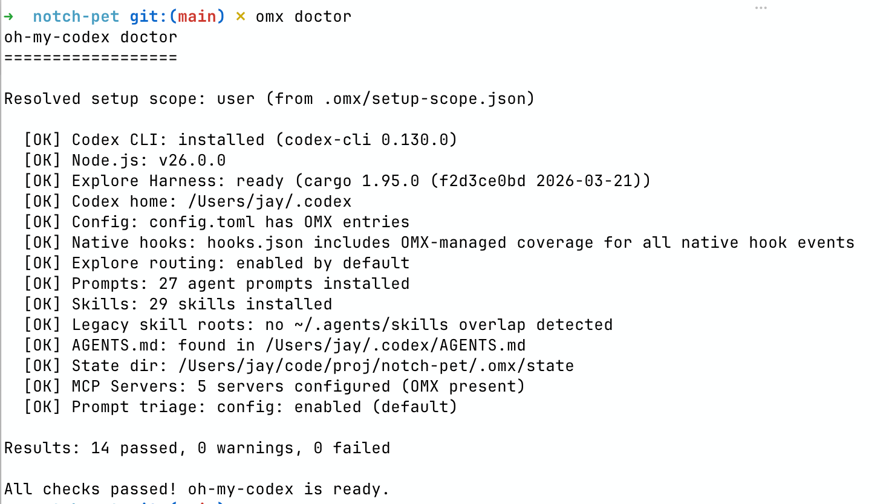

现在 Vibe Coding 时会遇到很多痛点：

- Agent 有时并不能正确理解需求
- 一令一动
- 缺乏规划能力
- 不能很好的拆分任务导致上下文窗口被占满
- 缺乏自省机制
- ......

这些痛点导致无法将 Agent 当做一个可靠的战友，只能把它当做一个工具让我来使用。

## OMX 是什么

如果你也有上述痛点，那 `oh-my-codex` 值得一试，它不是另一个大模型，也不是用来替代 Codex 的工具。
它更像是一个 “编排层” 或者 “工作流增强层” ，套在 Codex 外面，给你补上这些能力：

1. 更清晰的任务推进流程
2. 更适合复杂任务的多 Agent 协作方式
3. 项目级的 `AGENTS.md` 规范注入
4. 持久化的状态、计划、日志和运行时目录
5. 一套约定好的工作方式，比如先理解需求、再制定技术方案、再执行

你可以理解为， Codex 是一个很聪明的实习生，它可以帮你来完成一些工作，但缺少一套工作流来告诉它什么时候做什么样的事情。
有了 OMX 之后，它可以帮你组织 agent 怎么更聪明的干活，减少人工的介入。

官网地址：[https://oh-my-codex.dev](https://oh-my-codex.dev)

GitHub 地址：[https://github.com/Yeachan-Heo/oh-my-codex](https://github.com/Yeachan-Heo/oh-my-codex)

## 环境要求

最基本的要求包括：

- Node.js 20+
- Codex CLI
- Rust 环境（可选）

如果你要使用团队模式，还会涉及：

- macOS / Linux 下的 `tmux`
- Windows 下的 `psmux`

但对于新手来说，单人工作流完全够用，所以本篇是介绍单人工作流的使用。

## 安装

```bash
volta install oh-my-codex
# 或者
npm install -g on-my-codex

omx setup

omx doctor
```

> 我使用了 volta 包管理工具类似 nvm、fnm，直接使用 npm install -g 也是可以的

> 安装后执行 omx doctor 输出和下方一致（全部显示OK）则代表安装成功



## 使用

### 在 Codex 会话里输入 OMX 工作流指令

比如：

```bash
$deep-interview "clarify the auth change"
$ralplan "approve the auth plan and review tradeoffs"
$ralph "carry the approved plan to completion"
```

这三步分别代表：

- `$deep-interview`：先和 Codex 澄清需求和梳理边界情况，这一步 OMX 会反复确认需求细节；
- `$ralplan`：把梳理完后的需求整理成实施计划；
- `$ralph`：按照批准的计划执行到完成。

这就是 OMX 最核心的使用方式。

### 举个实际的例子

假设线上反馈了一个偶现的 Bug：下单接口偶尔返回 500，本地复现不了，日志也只剩一行 `Internal Server Error`，连堆栈都没有。

按以往的习惯，我大概率会直接甩给 Codex 一句 "帮我看看下单接口为什么偶尔报 500"，然后它要么乱猜一通改一堆文件，要么问一两个问题就开始动手。OMX 的三步走在这种 "信息不全" 的场景下就特别有用。

#### 第一步：`$deep-interview` 把信息榨干

```bash
$deep-interview "线上下单接口偶现 500，本地无法复现，需要定位根因"
```

Codex 不会马上动手，而是开始反复追问：

- 500 出现的频率？特定时间段还是随机？
- 是不是某些用户、某些商品才会触发？
- 接口背后调用了哪些下游？数据库、缓存、第三方支付？
- 最近有没有发布、配置变更、流量峰值？
- 现有的日志、监控、链路追踪能看到什么？

这一步看起来啰嗦，但实际是在帮我把脑子里散落的线索全部摆到桌面上。我经常在回答到第三、第四个问题时自己就想起来 "对，昨天确实改过一个事务隔离级别"，问题方向立刻就收敛了。

#### 第二步：`$ralplan` 出一份可审阅的方案

把澄清完的需求交给规划：

```bash
$ralplan "approve the plan and review tradeoffs"
```

OMX 会输出一份分阶段的计划，大致结构是这样的：

1. 先在测试环境补全链路日志（在哪几个文件加什么字段）
2. 写一个能稳定复现的脚本（基于 deep-interview 圈出的可疑用户特征）
3. 定位到根因后给出修复方案 A / 方案 B 和各自的取舍
4. 回归验证清单

我看这份计划的时候是带着 "改哪里、不该改哪里" 的视角，比直接看一堆 diff 容易判断得多。需要调整的地方直接回复 Codex 让它改方案，而不是改代码——这一步是纯文本来回，成本极低。

#### 第三步：`$ralph` 按计划推进

方案确认后：

```bash
$ralph "carry the approved plan to completion"
```

Codex 就会按上面那份计划一步一步执行：加日志 → 跑复现脚本 → 定位 → 修 → 跑验证清单。每完成一个阶段会停下来汇报，我只要盯着关键节点点头就行，不需要全程盯着它打字。

整套下来比起 "直接让 Codex 改代码"，前两步多花了十几分钟，但定位准、修改范围小、回滚也容易。对偶现 Bug 这种 "错一次就要从头再来" 的任务，尤其值。
